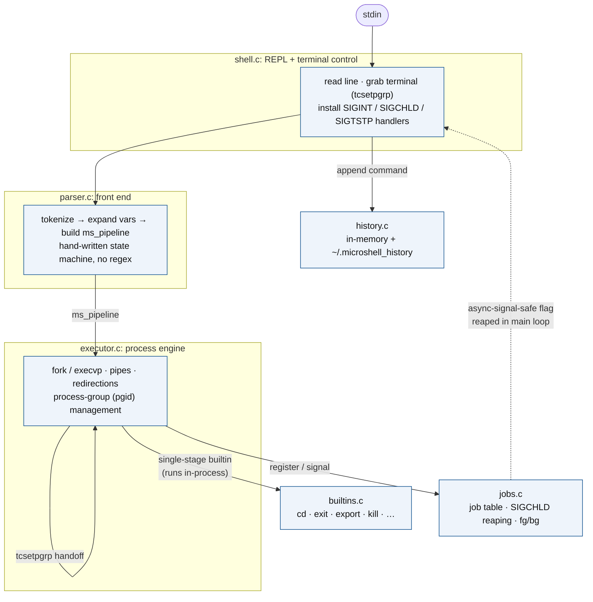

# microshell

> A small but real Unix shell in C.

[](https://github.com/sviatil0/microshell/actions/workflows/ci.yml)
[](LICENSE)


`microshell` is an interactive POSIX-ish shell written from scratch in
about a thousand lines of C. It implements the core mechanics any "real"
shell needs — fork/exec, pipelines, redirections, signal handling,
process-group / terminal-control transfer, job control, history,
variable expansion — without leaning on `readline`, `libedit`, or any
of the usual textbook scaffolding. Just libc.

The point isn't to replace `bash`. The point is to show that the
ideas behind `bash` are not magic, and to do them carefully.

## Features

- [x] Interactive REPL with a `cwd`-aware prompt
- [x] External commands via `fork` / `execvp`
- [x] Multi-stage pipelines: `a | b | c | ...`
- [x] Redirections: `<`, `>`, `>>`, `2>`
- [x] Background jobs: `cmd &`, plus `jobs`, `fg`, `bg`, `kill`
      (`kill` takes numeric `-9` or symbolic `-SIGKILL`/`-KILL`)
- [x] Builtins: `cd`, `pwd`, `exit`, `export`, `unset`, `env`, `help`,
      `history`, `jobs`, `fg`, `bg`, `kill`
- [x] Variable expansion: `$VAR`, `${VAR}`, `$?`
- [x] Single + double quotes with proper backslash handling
- [x] Line comments: `# ...`
- [x] In-memory history persisted to `~/.microshell_history`
- [x] Real signal handling: `SIGINT` cancels the line, `SIGCHLD` reaps,
      `SIGTSTP` / `^Z` stops the foreground job, terminal control is
      transferred with `tcsetpgrp(2)` like bash does
- [x] Clean build with `-Wall -Wextra`, no third-party deps

## Demo

```
$ ./microshell
microshell - type 'help' for builtins, 'exit' to quit.
microshell ~/code/microshell$ echo "hello $USER"
hello stefan
microshell ~/code/microshell$ cat src/parser.c | wc -l | tr -d ' '
357
microshell ~/code/microshell$ ls /no_such_dir 2> errors.log
microshell ~/code/microshell$ cat errors.log
microshell: /no_such_dir: No such file or directory
microshell ~/code/microshell$ sleep 5 &
[1] 88421
microshell ~/code/microshell$ jobs
[1]  Running          sleep 5
microshell ~/code/microshell$ # ...five seconds later...
[1]+  Done            sleep 5
microshell ~/code/microshell$ exit
```

## Build + run

Requirements: a C11 compiler (`gcc` or `clang`), `make`, and a POSIX
environment. Tested on Linux and macOS.

```sh
git clone https://github.com/sviatil0/microshell.git
cd microshell
make                # produces ./microshell
./microshell
```

Optional install:

```sh
sudo make install   # installs to /usr/local/bin/microshell
```

Override the install prefix or compiler:

```sh
make CC=clang
make install PREFIX=$HOME/.local
```

## Architecture



<details>
<summary>ASCII fallback (same architecture)</summary>

```
            +------------------+
   stdin -->|     shell.c      |   REPL: read line, drive everything
            |  (signal setup,  |   handles SIGINT / SIGCHLD / SIGTSTP
            |   terminal grab) |
            +---------+--------+
                      |
                      v
            +------------------+
            |    parser.c      |   tokenize -> expand -> build pipeline
            |   (ms_parse)     |   (no regex, plain state machine)
            +---------+--------+
                      |
                      v
            +------------------+        +-----------------+
            |  executor.c      | -----> |   builtins.c    | (cd, exit, ...)
            |  (fork/exec,     |        +-----------------+
            |   pipes, redirs, |
            |   pgid mgmt)     | -----> +-----------------+
            +---------+--------+        |    jobs.c       | (table, reaping,
                      |                 +-----------------+  fg/bg control)
                      v
            +------------------+
            |   history.c      |   in-memory + ~/.microshell_history
            +------------------+
```

</details>

Each module has a single responsibility and a short public header
(`parser.h`, `executor.h`, `builtins.h`, `jobs.h`, `history.h`). Global
mutable state is intentionally confined to `jobs.c` and `history.c` —
everywhere else, ownership is explicit and short-lived.

## Supported syntax cheat sheet

| Form                                | Meaning                                         |
| ----------------------------------- | ----------------------------------------------- |
| `cmd arg1 arg2`                     | Run `cmd` with arguments                        |
| `cmd1 \| cmd2 \| cmd3`              | Pipeline (any number of stages)                 |
| `cmd > file`                        | Truncate-write stdout to `file`                 |
| `cmd >> file`                       | Append stdout to `file`                         |
| `cmd < file`                        | Read stdin from `file`                          |
| `cmd 2> file`                       | Redirect stderr to `file`                       |
| `cmd &`                             | Run in the background, register as a job        |
| `"$VAR"`, `${VAR}`, `$?`            | Variable expansion (`$?` = last exit status)    |
| `'literal text'`                    | Single quotes: no expansion, no escapes         |
| `"text $VAR"`                       | Double quotes: expansion + `\\`-escapes         |
| `\<char\>`                          | Backslash escapes one character                 |
| `# rest of line`                    | Comment                                         |
| `%n` (in `fg`, `bg`, `kill`)        | Refer to job number `n`                         |

## Implementation notes

A few things that are easy to get subtly wrong, and what I did about
them:

- **Line editor.** I rolled my own (`fgets`-style char-by-char read in
  `shell.c::read_line`) rather than linking `readline`. The build stays
  dependency-free and portable, and the code is honest about what's
  happening with the terminal. Tradeoff: no fancy editing, no
  tab-completion, no up-arrow recall in the prompt itself (history is
  still available via the `history` builtin).
- **`SIGCHLD` is async-signal-restricted.** The handler does exactly
  one thing: set a `volatile sig_atomic_t` flag. The main loop calls
  `ms_jobs_reap()` at a safe point. No `printf` from the handler — that
  would be a textbook async-signal-safety bug.
- **Terminal control.** Before launching a foreground pipeline,
  `tcsetpgrp(tty, pgid)` hands the controlling tty to the pipeline's
  process group; the parent reclaims it after the wait. Without this,
  `^C` would kill the shell instead of the child.
- **Process groups.** First child of a pipeline calls `setpgid(0, 0)`,
  becoming its own group leader. Every later stage joins via
  `setpgid(0, pgid)`. The parent also calls `setpgid()` on each child
  to close the obvious race. This is the same dance the GNU libc
  manual prescribes for a job-control shell.
- **`cd` / `exit` / `export` run in-process.** They have to: a child
  process changing directories is a no-op as far as the shell is
  concerned. The executor detects a single-stage foreground builtin
  and runs it in-process (with `dup2`-based redirections saved/restored
  around the call). Builtins inside pipelines still work, but their
  side effects are scoped to the child.
- **Variable expansion happens in the tokenizer.** That keeps the
  parser proper trivial and matches how bash handles `$VAR` inside
  double quotes vs. single quotes.

## Differences from bash / zsh

`microshell` is intentionally small. Things bash has that this doesn't:

- `&&`, `||`, `;` command sequencing
- Functions, aliases
- Brace expansion (`{a,b,c}`), tilde expansion beyond the prompt,
  globbing / wildcard expansion (`*`, `?`, `[...]`)
- Command substitution `$(cmd)` / backticks
- Here-documents (`<<EOF`)
- Multi-line continuations and complex control flow (`if`, `for`,
  `while`, `case`)
- Process substitution `<(cmd)`
- Job-control niceties like `disown`, `wait %n`, `suspend`
- A real line editor (cursor movement, history scroll, completion)

If you need any of those, use bash. If you want to understand how the
ones that *are* here actually work under the hood, read the source —
it's about a thousand lines and every module has a header comment.

## Testing

```sh
make test
```

This runs two suites that pipe scripted input into the binary and
diff the output:

- `tests/test_parser.sh` — parser edge cases (quoting, expansion,
  comments, pipes, escapes).
- `tests/integration.sh` — redirections, builtins, exit-status
  propagation, multi-stage pipelines, backgrounding, and `kill`
  signal parsing (numeric and symbolic).

Thirty cases total; all green on Linux and macOS.

CI (Ubuntu + macOS, gcc + clang) is wired in `.github/workflows/ci.yml`.

## License

[MIT](LICENSE) © 2026 Stefan Oleksiienko
